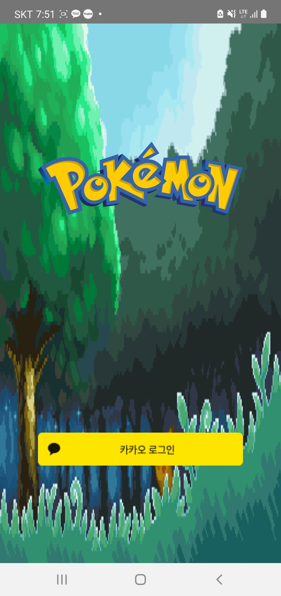

# 몰캠몬스터(Molkemon)

## Summary.

포켓몬을 이용한 방치형 육성, 레이드 게임.

### Train

Train에서는 본인의 포켓몬의 스킬을 코인을 이용하여 육성하도록 함.
스킬 육성 시 포켓몬은 경험치를 획득.
경험치 획득을 통해 레벨업을 할 수 있고, 특정 레벨이 되면 진화 및 사용가능한 스킬이 늘어남.

### Adventure

Adventure에서는 야생의 포켓몬을 사냥면서 경험치와 코인을 얻을 수 있음.
포켓몬 레벨과 스킬 종류, 레벨에 따라서 공격력이 결정됨.

### Raid

Raid에서는 분반 별로 보스 몬스터를 같이 사냥하면서 경쟁하는 컨텐츠.
하루에 3번만 입장이 가능하며, 많은 양의 경험치와 코인을 얻을 수 있음.

## Implementation.

### Backend

NodeJS를 이용하여 Express 서버에 [socket.IO]("https://https://socket.io/")를 이용하여 구축하였다.  

데이터베이스는 mysql을 이용하여 유저 정보, 포켓몬 정보, 레이드 정보를 나누어 저장하였다.

로그인은 자체적으로 구현하지 않고, Kakao Login SDK를 이용하여 유저의 고유 id만을 저장하였다.

### Frontend

로그인 액티비티, 회원가입 액티비티, 메인 액티비티(train, adventure, raid 프래그먼트)로 나누어 구현하였다.

## Made By.

[POSTECH 컴퓨터공학과 18학번 조원경](https://github.com/wkcho99)

[KAIST 전산학부 17학번 권기훈](https://www.github.com/kyoonkwon)
